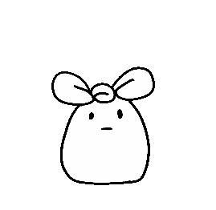

<h1 style="margin-bottom:-1em;">Hello there 👋</h1>
<h2>I'm
<select>
<option> Sanghun </option>
<option> Joseph </option>
<option> Kyo </option>
</select>
</h2>

<h4>
I am a(n): 

programmer

Python 
Django 
C-Sharp 
Go-lang 
HTML/CSS 

artist

Ceramics 
Webtoon 
Illustration 

trashbunny

</h4>

#### I'm currently occupied with:
<ul class="tasks">
<li> Learning more about CSS and javascript for web design</li>
<li> Delevoping a collection of apps to practice better organization and archetecture of codes </li>
<li> Making a whole brand out of trashbunny</li>
</ul>

 